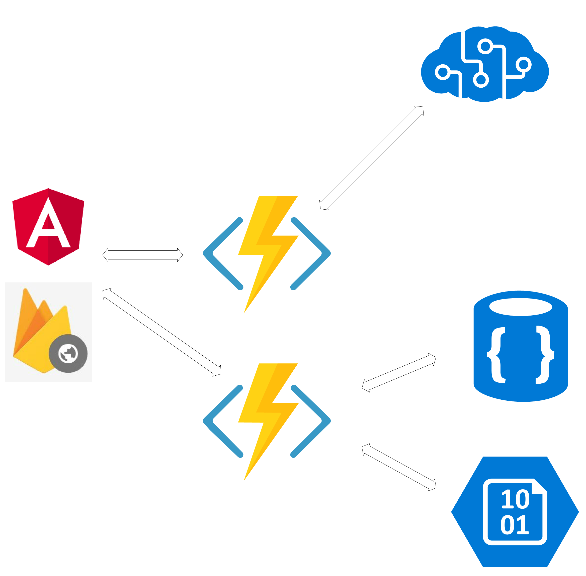
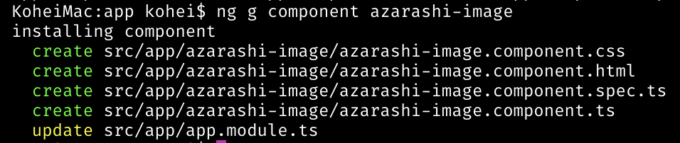

# AngularとAzureのCustom Vision Serviceを使って画像認識サイトを作ってみたよー

---

# About me

**新見 晃平**

フロントエンドと機械学習のエンジニアになろうと頑張っています(｀・ω・´)

- Twitter: @gupuru
- GitHub: gupuru

---


# 花の名前を教えてくれるサービス作りましたー(・ω・)

---



# [fit] 構成はこんな感じ。
## フロントはAngular4系を使いました。

---

# Custom Vision Service


- 簡単に言えば、自分で画像認識のモデルが作成できるサービスです。
- GUIで操作、さらにAPIつき

---


# さっきのやつを作った時に参考になったサイトや便利だったツールなどを紹介しようと思います。
## これからAngularを始めようしている人の手助けになれば幸いです。

---

# 1. CLIを使う(｀･ω･´)

## とても強力です！下手に自分で作るより、
## CLI使ったほうがいいです。

```
npm install -g @angular/cli
```

---

## ちなみに、、、CLIを使わずに、自分で環境を作って開発している人って、いますか？？？
### ※CLIは甘え　by どこかの犬

---


# CLIを使えば、こんな感じに一瞬でプロジェクトが作れます。

```
ng new ng-fukuoka-samplecd 
```

---



# componentも

```
ng g component azarashi
```

---

# [fit] あ、ちなみに、WebStormを使えば、GUIできます！


---

# [fit] 2. Angularを使ったWebサイトの作り方(｀･ω･´)

## [fit] ng-japanさんのハンズオンの資料とても分かりやすかったです！
## これをやるだけで、基本が学べました。

https://github.com/ng-japan/hands-on

--- 

# material-todoappの章で、
# [fit] deprecatedがあるので、そこは注意ｗ

---

# 3. Rx(｀･ω･´)

## AngularはRxが多く使われています。
## CodeGridさんの記事が分かりやすかったです。

https://app.codegrid.net/entry/2017-rxjs-1

---

# 4. 通信まわり(｀･ω･´)

## [fit] 通信まわりは、公式のドキュメントが分かりやすかったです。

https://angular.io/guide/http#http

---

# [fit] Angularは、公式のドキュメントが豊富です。
#### 英語ですが、、、

---

# [fit] 5. サーバーに置くで(｀･ω･´)

```
ng build
```

# [fit] ここのファイルをサーバーに置いたら、おｋ


---

# 通常ならこれでいいですが、、、

このようなURLだと、、、

```
https://inu.com/hoge/index.html
```

fileないよ！って言われますｗ

```
inline.bundle.js Failed to load resource: the server responded with a status of 404 (The specified resource does not exist.)
vendor.bundle.js Failed to load resource: the server responded with a status of 404 (The specified resource does not exist.)
polyfills.bundle.js Failed to load resource: the server responded with a status of 404 (The specified resource does not exist.)
styles.bundle.js Failed to load resource: the server responded with a status of 404 (The specified resource does not exist.)
main.bundle.js Failed to load resource: the server responded with a status of 404 (The specified resource does not exist.)
vendor.bundle.js Failed to load resource: the server responded with a status of 404 (The specified resource does not exist.)
main.bundle.js Failed to load resource: the server responded with a status of 404 (The specified resource does not exist.)
```

---

# [fit] 先程のようなURLの場合こんな感じにすると、おｋ

```
ng build --prod -bh /hoge/"
```

---

# まとめ

---

# Angular楽しい(｀･ω･´)

---


# [fit] **ご清聴ありがとうございました！**

